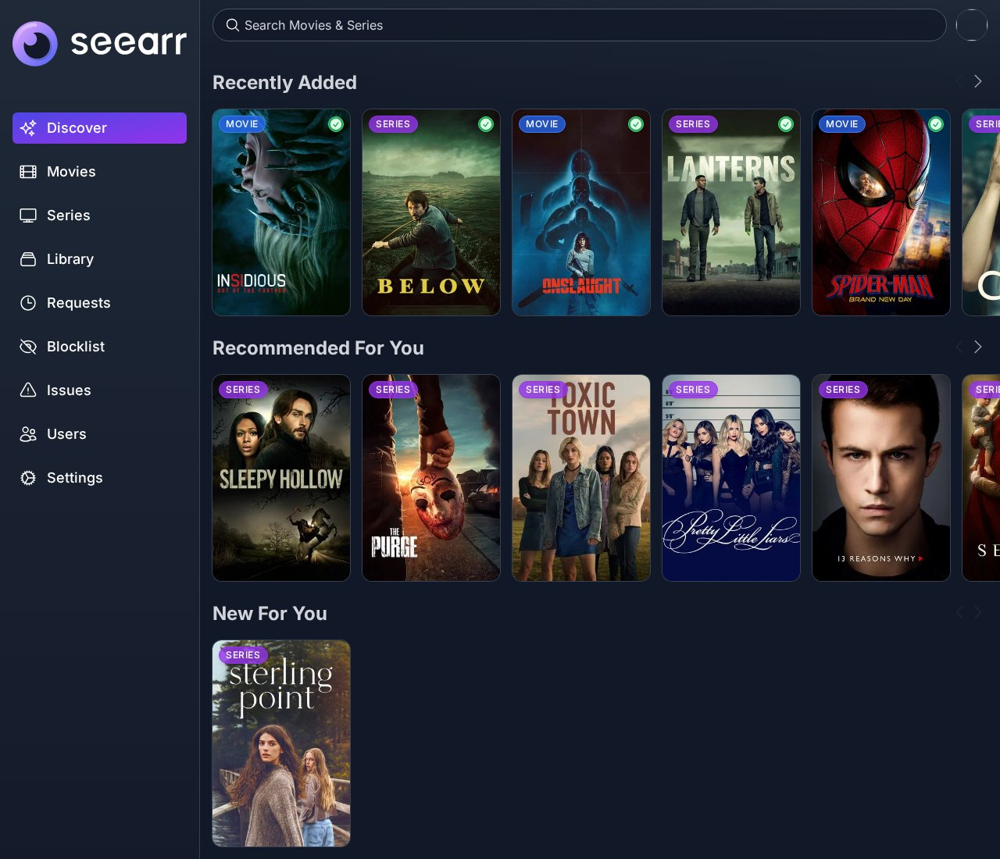
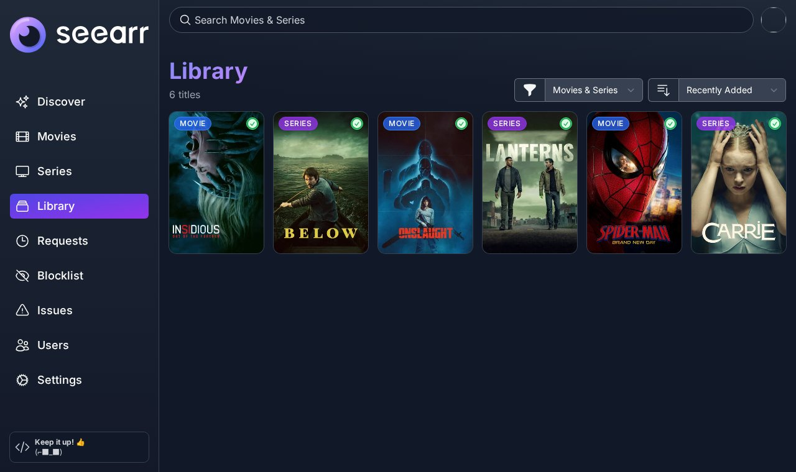

<p align="center">

</p>
<p align="center">
<a href="https://github.com/seerr-team/seerr"></a>
<a href="https://github.com/Project516/seearr/blob/master/LICENSE"></a>
</p>

**Seearr** is a fork of [Seerr](https://github.com/seerr-team/seerr) stripped down to a **Radarr/Sonarr-only media request manager**. No Plex, no Jellyfin, no Emby. Discover new media via TMDb and add it to your *arr services.

Designed for bare-metal self-hosting first. Multi-arch Docker images (amd64 and arm64) are also published to GHCR.

## Recommendations for every user

The Discover page has two rows built for whoever is signed in:

- **Recommended For You**: titles TMDB recommends for your recent requests and for what Radarr and Sonarr have downloaded. A title recommended for several of them ranks higher.
- **New For You**: the same list, limited to titles released in the last 180 days.

There is nothing to set up. The rows appear once the user has made a request or Radarr or Sonarr has downloaded something. They use the TMDB connection Seearr already has, with no extra service, API key or AI model. See [how titles are picked](docs/using-seerr/recommendations.md).



## Library

The Library page lists every movie and series Radarr and Sonarr have downloaded, and you can filter it by media type and sort it by date added or last updated. See [the Library docs](docs/using-seerr/library.md).



## What's different from Seerr

- **Plex, Jellyfin & Emby removed.** Their sign-in, scanners, settings and UI are gone
- **Radarr & Sonarr only.** Discover via TMDb, request to your *arr services
- **No media server dependency.** The library comes from Radarr and Sonarr. No deep links, no Plex watchlist sync
- **First-run wizard.** Create your admin account without a media server sign-in
- **Portable.** Config and data live in the same directory as the app
- **Follows upstream releases.** A daily workflow opens a pull request for each new stable Seerr release

## Getting Started

```bash
git clone https://github.com/Project516/seearr.git
cd seearr
bash start.sh
```

The `start.sh` script will:
1. Check prerequisites (Node.js 22+, pnpm)
2. Install dependencies and build
3. Create a default `config/settings.json`
4. Start the server on port 5055
5. Open http://localhost:5055 in your browser once it responds (`NO_BROWSER=1` to skip)

Or run setup and start separately:

```bash
bash setup.sh    # install + build only
bash start.sh    # run setup + start
```

The setup wizard will:
1. Create your admin account
2. Configure Radarr & Sonarr connections

Prefer Docker? See [docs/getting-started/docker.mdx](https://github.com/Project516/seearr/blob/master/docs/getting-started/docker.mdx) or pull `ghcr.io/project516/seearr:latest`.

### Quick start (manual)

```bash
CONFIG_DIRECTORY="$PWD/config" \
NODE_ENV=production \
PORT=5055 \
node dist/index.js
```

### Environment variables

| Variable | Default | Description |
|----------|---------|-------------|
| `PORT` | `5055` | HTTP port |
| `CONFIG_DIRECTORY` | `./config` | Path to config folder |
| `DB_TYPE` | `sqlite` | `sqlite` or `postgres` |
| `DB_HOST` | — | PostgreSQL host |
| `DB_PORT` | `5432` | PostgreSQL port |
| `DB_USER` | — | PostgreSQL user |
| `DB_PASS` | — | PostgreSQL password |
| `DB_NAME` | `seerr` | PostgreSQL database name |
| `HOST` | — | Listen address (e.g. `0.0.0.0`) |
| `API_KEY` | — | Override auto-generated API key |

## Updating

Bare metal: pull the latest code and start again. `start.sh` installs dependencies, and rebuilds when the source changed, before it starts the server.

```bash
git pull
bash start.sh
```

Docker: pull the new image and recreate the container.

```bash
docker pull ghcr.io/project516/seearr:latest
```

Each new stable Seerr release arrives as a pull request that a daily workflow opens. Merging it publishes a matching Seearr release.

## Requirements

- **Node.js** 22+
- **pnpm** 10+
- **SQLite** (default) or **PostgreSQL** (optional)
- **Radarr** (for movies)
- **Sonarr** (for TV series)

## Features

- TMDb-powered discovery (trending, popular, genres, upcoming)
- Radarr & Sonarr integration (add movies/TV to download queue)
- Personal "Recommended For You" and "New For You" rows on Discover
- Library page listing everything Radarr and Sonarr have downloaded
- SQLite & PostgreSQL support
- Customizable request system (per-season or full)
- Override rules that set the quality profile, root folder or tags based on the requesting user, genre, language or keywords
- Granular permission system
- Notification agents (Discord, Telegram, Email, Pushover, etc.)
- Blocklisting
- Mobile-friendly UI
- Full REST API (docs at `/api-docs`)
- Scheduled jobs (Radarr and Sonarr scans, download sync, availability sync)

## Upstream

This project is a fork of [seerr-team/seerr](https://github.com/seerr-team/seerr). All credits to the original Seerr team.
